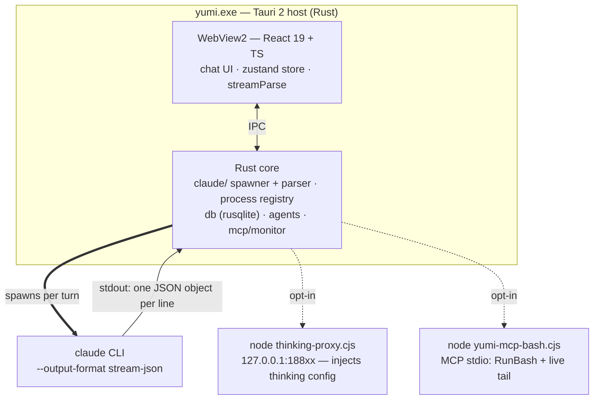
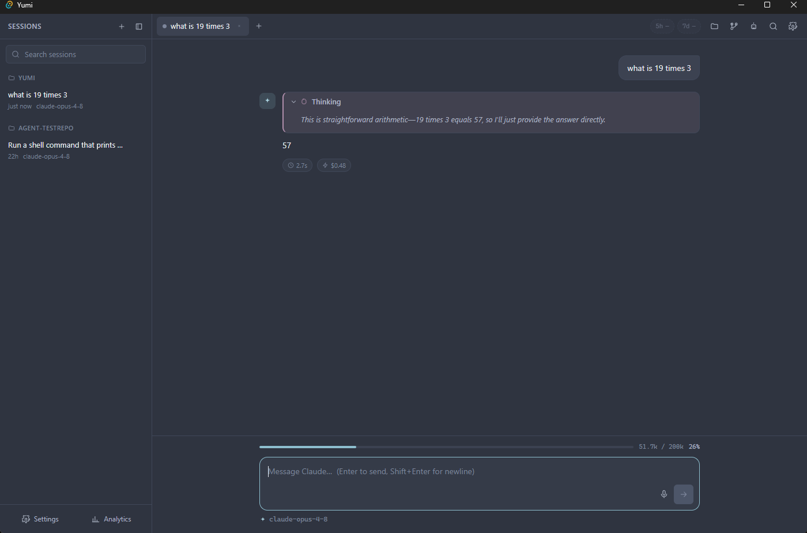

# Architecture

*The process model and the end-to-end path a single prompt takes through Yumi.*

## Process model

Yumi is one desktop application made of several cooperating processes:



1. **Tauri host (`yumi.exe`, Rust).** Owns the window, the SQLite database, the
   process registry, and all `#[tauri::command]` handlers. Also hosts
   `process::guard` (a process-wide child-PID set that tree-kills spawned `claude`
   processes and the thinking-proxy on panic or normal exit) and
   `claude::resources` (sidecar resolution: `resource_dir()` first, dev
   ancestor-walk fallback). Entry point is `src-tauri/src/main.rs` → `lib.rs::run()`.
2. **WebView2 (React).** The entire UI: chat, tabs, input, side panels, overlays.
   State lives in a zustand store (`src/lib/store.ts`); the UI talks to Rust only
   through the typed wrappers in `src/lib/ipc.ts`.
3. **`claude` CLI (spawned per turn).** A fresh child process for each prompt,
   launched with `--output-format stream-json --verbose
   --include-partial-messages --dangerously-skip-permissions [--resume <uuid>] -p
   <prompt> --model <model>`. Its stdout is the source of truth.
4. **`thinking-proxy.cjs` (optional, Node).** A localhost HTTP proxy that injects
   the interleaved-thinking config into the upstream Anthropic request; the spawned
   `claude` is pointed at it via `ANTHROPIC_BASE_URL`. See [Thinking Proxy](thinking-proxy.md).

   !!! note "`ANTHROPIC_BASE_URL` dual-use"
       `ANTHROPIC_BASE_URL` serves two mutually exclusive roles: when the thinking
       proxy is active it points `claude` at the localhost proxy; when a non-Claude
       provider is selected it points `claude` at the user's router
       (claude-code-router / LiteLLM / OpenRouter). The two cannot be active
       simultaneously — enabling a non-Claude provider supersedes the proxy URL.

5. **`yumi-mcp-bash.cjs` (opt-in, Node).** An MCP stdio server registered with the
   spawned `claude` when the bash monitor is on, so shell runs through
   `mcp__yumi-bash__RunBash` and streams live into the tool card. See
   [MCP Bash Server](mcp-bash-server.md).

Persistence is SQLite (WAL) at `~/.yumi/yumi.db`. Sidecar state (background
processes, AskUserQuestion IPC) lives under `~/.yumi/`; transient bash stream logs
live in `%TEMP%`.

## End-to-end: the life of one prompt

The path a single turn takes, with the responsible source file:

```mermaid
sequenceDiagram
    autonumber
    participant U as User
    participant S as store.ts (send)
    participant R as spawner.rs
    participant C as claude CLI
    participant P as stream_parser.rs
    participant Red as streamParse.ts
    U->>S: type prompt + send
    S->>R: invoke "spawn_claude" (opts)
    R->>R: resolve provider · (opt) MCP config + proxy
    R->>R: sanitize env · spawn (tokio) · register PID
    R->>C: claude --output-format stream-json …
    C-->>R: stdout — one JSON object per line
    R->>P: parse_line(line)
    P-->>R: ClaudeEvent[] (unknown → raw)
    R-->>Red: emit "claude-event" {sessionId, event}
    Red->>Red: reduceEvent(message, event)
    Red-->>U: re-render the active ChatPane
    Note over R,Red: finalize on turn_done (end_turn) — not the late result;<br/>then drain stdout silently; record analytics + claude-cost (pid-gated)
```

On finalize the store calls `_persist(tabId)`, writing the conversation to the
`sessions` + `messages` tables. The other emitted channels are `claude-session-id`
(real uuid), `claude-complete`, `claude-cost` (late cost), and `claude-error`.

<figure markdown="span">
  
  <figcaption>The output of one full turn — the spawned <code>claude</code>'s <code>stream-json</code> parsed into a thinking block, the rendered answer, and the live token bar plus the <code>⏱</code>/<code>⚡</code> cost footer.</figcaption>
</figure>

## Key timing detail: finalize on `end_turn`, not `result`

!!! warning "Why the turn finalizes early"
    The spawned `claude -p` runs the user's **post-turn Stop hooks before** it emits
    the final `result` line, which in a heavy-hook environment can delay `result` by
    30–60 s after the answer is already on screen. Yumi therefore finalizes the turn
    (flips Stop → Send, re-enables input) on the `message_delta` `stop_reason:
    "end_turn"` signal — surfaced as a `turn_done` event — which arrives as soon as
    the answer completes (~10 s). A `tool_use` / `pause_turn` stop reason is **not**
    terminal, so multi-step tool turns are unaffected.

After finalizing, the backend keeps **draining the lingering process's stdout
silently** (so its pipe never blocks and its hooks complete) but stops emitting
normal stream events. There is one exception: a trailing `rate_limit_event` (which
the CLI emits after `end_turn`, in the order `end_turn → rate_limit_event →
result`) is forwarded **even after finalize** so the rate-limit pills can update
live — but only if this process still owns the session (pid-gated), preventing a
lingering turn from pushing onto a newer one. When the late `result` is drained it
is used for analytics and a `claude-cost` side-channel event, also pid-gated. The
full rationale is in [Reliability & Design](reliability-and-design.md).

## The contract that holds it together

The frontend and backend converge on a single frozen interface:

- **`src/lib/types.ts`** — the `ClaudeEvent` union and every data shape, authoritative.
- **`src/lib/ipc.ts`** — typed wrappers over `invoke()` and event `listen()`.
- Rust mirrors these with `#[serde(rename_all = "camelCase")]` so JSON matches the TS field names, and Tauri command argument names are camelCase (`sessionId`, not `session_id`).

This contract is documented in full on the [IPC Contract](ipc-contract.md) page,
and the event-to-message mapping on the [Stream Pipeline](stream-pipeline.md) page.

## Where to go next

| If you want to understand… | Read |
|----------------------------|------|
| The Rust modules and what each does | [Backend (Rust)](backend-rust.md) |
| The React store, components, and reducer | [Frontend (React)](frontend-react.md) |
| Exact commands, events, and types | [IPC Contract](ipc-contract.md) |
| How `stream-json` becomes messages | [Stream Pipeline](stream-pipeline.md) |
| What's stored and where | [Data & Persistence](data-and-persistence.md) |
| Why the design is robust | [Reliability & Design](reliability-and-design.md) |
