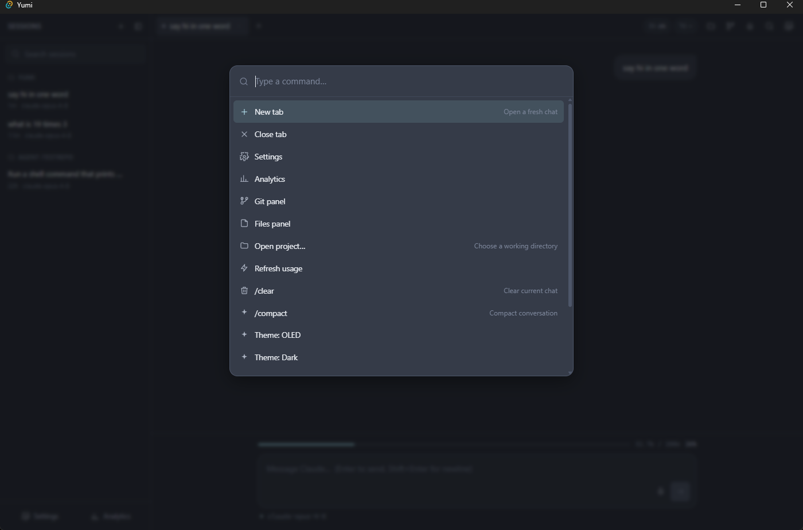
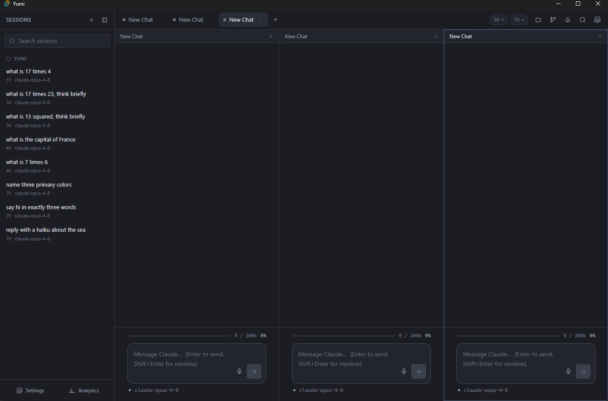
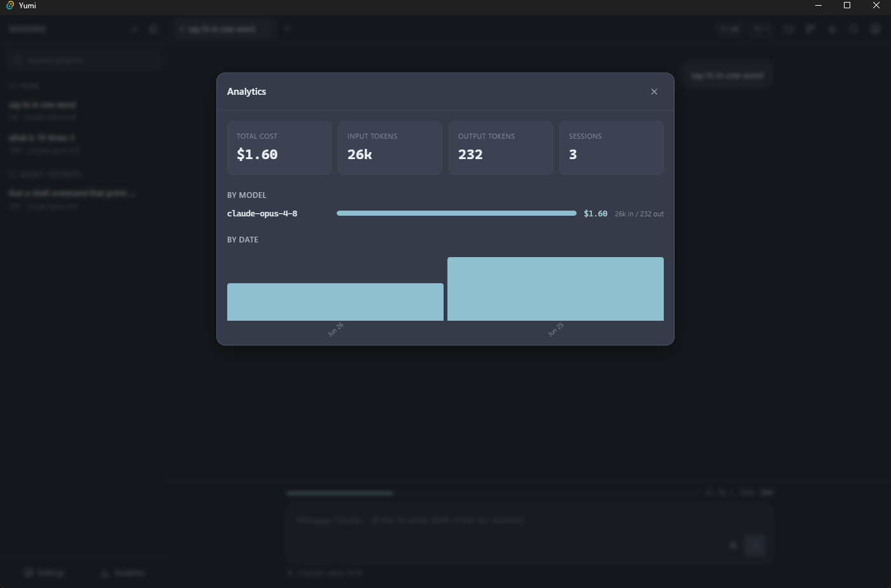

# Features & Shortcuts

*The feature catalogue with its parity status, and the complete keyboard map.*

---

## Keyboard shortcuts

The global keydown handler lives in `src/lib/shortcuts.ts`. (`Ctrl` is `Cmd` on macOS.)

| Key | Action |
|-----|--------|
| `Esc` | close the active overlay, then the active panel |
| `F5` | toggle voice dictation |
| `F7` | add a split pane (up to 6) |
| `F8` | remove the last split pane |
| `Ctrl+T` | new tab (inherits the current cwd) |
| `Ctrl+W` | close the active tab |
| `Ctrl+P` | command palette |
| `Ctrl+,` | settings |
| `Ctrl+G` | toggle the git panel |
| `Ctrl+E` | toggle the files panel |
| `Ctrl+Y` | analytics overlay |
| `Ctrl+L` | force-refresh rate limits |
| `Ctrl+O` | open project (folder picker) |
| `Ctrl+B` | toggle the sessions sidebar |
| `Ctrl+Shift+A` | toggle the background-agents panel |
| `Ctrl+Tab` | cycle to the next tab |
| `Ctrl+Shift+Tab` | cycle to the previous tab |

The same list is shown in the Settings overlay (the `SHORTCUT_HINTS` reference).

---

## Feature catalogue

Status legend matches `yumi/PARITY.md`: ✅ done & verified · 🟢 done (lighter
verification) · 🟡 scoped/stub · ⬜ intentionally omitted.

<figure markdown="span">
  
  <figcaption>The command palette (<code>Ctrl+P</code>) — a fuzzy launcher for tabs, panels, overlays, project switching, slash-commands, and theme changes.</figcaption>
</figure>

### Core chat loop ✅
- Locate + spawn `claude`, stream-json parsing, `--resume`.
- Render user/assistant text, **thinking blocks**, collapsible **tool cards** (input + result), markdown + syntax highlighting.
- Send, **interrupt/stop** (tree-kills via the [process registry](backend-rust.md)), new session/tab.
- Tabs & sessions, sidebar grouping by project, resume, SQLite persistence.

### Settings ✅
Provider, model, theme (6 themes, OLED default), vim toggle, thinking toggle,
rate-limit toggle, **bash-monitor toggle**, auto-compact threshold. Persisted to the
DB. See [Data & Persistence](data-and-persistence.md).

### Split panes (F7/F8) ✅
Up to **6** panes in a CSS grid, each a full `ChatPane` (own header, messages,
composer). F7 adds, F8 removes; click a pane to make it active. Backed by
`store.splitTabs`.

<figure markdown="span">
  
  <figcaption>Split-pane mode — three independent <code>ChatPane</code>s side by side, each with its own header, messages, composer, and token bar. <code>F7</code> adds a pane (up to 6), <code>F8</code> removes one.</figcaption>
</figure>

### History rollback ✅
A rewind affordance on every user message (`store.rollbackTo`) truncates the
conversation back to that turn and reloads the prompt into the composer for
edit/resend, then re-persists.

### Background agents (Ctrl+Shift+A) ✅
Run a headless `claude -p` in an **isolated git worktree** (`%TEMP%\yumi-agents\`,
branch `yumi/agent-<id>`), commit the result, then review the diff and **merge** it
back. The Agents panel shows status + diff + Merge/Cancel/Remove. Requires a git
repo cwd. Implementation: [`agents.rs`](backend-rust.md).

### Voice dictation (F5) 🟢
`useDictation` wraps the Web Speech API; interim + final transcripts append to the
active composer with a "Listening…" indicator. Degrades gracefully when WebView2
has no speech backend.

### Live bash monitor 🟢 (opt-in, off by default)
With the setting on, shell runs through the [MCP bash server](mcp-bash-server.md)
and streams **live** into the tool card's LIVE pane.

### Multi-provider 🟢
Every provider drives the **same** `claude` binary and stream-json parser. A
non-Claude provider (Gemini / GPT / Kiro) is realized by pointing that process
at a translating router (`ANTHROPIC_BASE_URL = settings.routerBaseUrl`) such as
claude-code-router, LiteLLM, or OpenRouter. Selecting a non-Claude provider with
no router URL configured returns a **clear error** — never a fake success.
`provider.rs` exposes `build_spawn_plan(provider, prompt, model, resume, router_base_url) → SpawnPlan`; the args are identical for every provider, only the base URL differs. Claude is the fully-verified path; the routing mechanism itself is verified (unit-tested in `provider::tests`).

### P1 surfaces 🟢
- **Rate-limit pills** (5h / 7d) — honest + live. `get_usage_limits` returns an honestly-inert state (`live:false`, no fake %) until a real `rate_limit_event` arrives in-stream; the pills then light up with live status, window type, and reset time via `store._onEvent → parseRateLimit`. Until then they render greyed `—` with an "unavailable" tooltip. See [Reliability & Design](reliability-and-design.md).
- **Git panel** — status + working/staged diff.
- **Files panel + `@`-mentions** — folder navigation and file insertion.
- **Command palette** — fuzzy slash-command launcher.
- **Token/context bar** — fills live from the `message_start` usage snapshot (not only end-of-turn); sums `input + cacheRead + cacheCreation + output` tokens; window size is dynamic per model via `contextWindowFor()` in `src/lib/models.ts` (200K for Claude, ~1M for Gemini, etc.).
- **Project picker + recent projects**.
- **Analytics dashboard** — real totals, by-model, by-date (see [Data & Persistence](data-and-persistence.md)).

<figure markdown="span">
  
  <figcaption>The analytics overlay (<code>Ctrl+Y</code>) — real totals (cost, input/output tokens, sessions) with by-model and by-date breakdowns, computed from the <code>analytics</code> table.</figcaption>
</figure>

### Per-message cost footer 🟢
Each finalized assistant message shows `⏱ duration` + `⚡ $cost`, attached via the
late `claude-cost` side channel. Shown live; **not** persisted to the DB (the
message schema has no cost column), so it does not survive a reload-from-history.

### Process guard (`process::guard`) ✅
A process-wide child-PID set (`src-tauri/src/process/guard.rs`) ensures spawned
`claude` children AND the thinking-proxy node process die with the host. Every
child PID is tracked via `guard::track(pid)` at spawn time. A `std::panic` hook
installed at startup calls `guard::kill_all()` before unwinding; the Tauri
`RunEvent::Exit` handler does the same on normal teardown. This covers the
failure mode where a host panic would otherwise orphan background processes.
See [Reliability & Design](reliability-and-design.md).

### Sidecar bundling (`bundle.resources` + `resolve_resource`) ✅
The `.cjs` sidecars (`yumi-mcp-bash.cjs`, `thinking-proxy.cjs`) and the
`yumi-plugin/` tree are declared as Tauri `resources` in `tauri.conf.json`.
At runtime `claude::resources::resolve_resource` tries `app.path().resource_dir()`
first (works in both the `--no-bundle` dev build and a production installer),
then falls back to the dev-layout ancestor-walk. This means the app will find
its sidecars in a production bundle, not only during development.

### Intentionally omitted ⬜
Licensing / payments / paywall, auto-update, and the VSCode companion extension.

## See also

- [Features in code](frontend-react.md) — the components behind each surface.
- `yumi/PARITY.md` — the authoritative, per-feature status matrix with evidence.
- [Reliability & Design](reliability-and-design.md) — why interrupt, finalize, and cost behave as they do.
