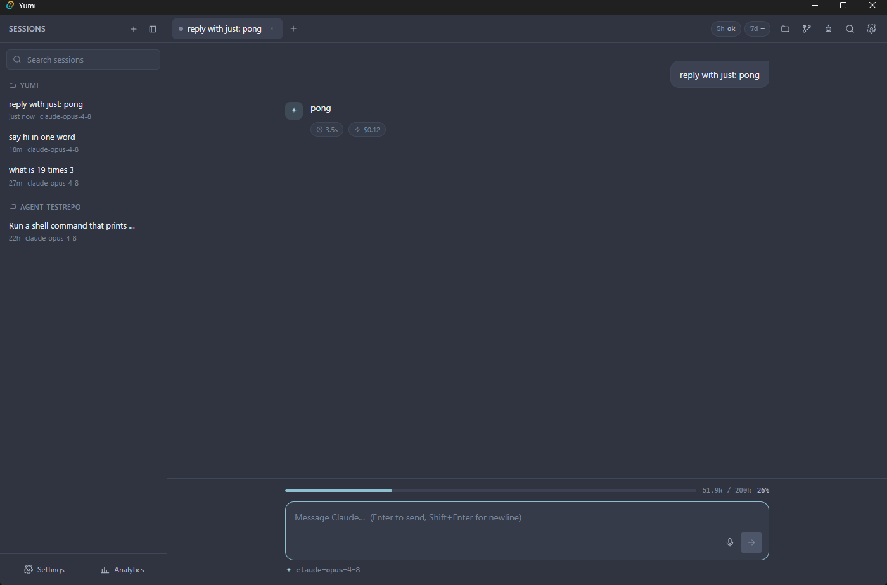

# Reliability & Design

*The non-obvious bugs that were root-caused, the fixes that resolved them, and the design decisions that fall out of them.*

---

Yumi spawns a real, full-featured CLI as a child process, which makes it subject to
a class of subtle failures around environment inheritance, process lifetime, and
hook timing. Five of these were root-caused and fixed; the fixes are load-bearing
and explain a lot of the backend's shape.

## 1. Environment-leak hang → env sanitization

**Symptom.** Launching Yumi from *inside* a Claude Code session caused multi-minute
hangs and zombie `claude` processes.

**Cause.** The spawned `claude` inherited the parent session's environment —
`CLAUDE_CODE_SESSION_ID` / `CLAUDECODE` / `ANTHROPIC_BASE_URL` / `CLAUDE_STREAM*` —
causing **session-id collision** and **proxy nesting**.

**Fix.** `claude/spawner.rs` strips every `CLAUDE_CODE_*`, `CLAUDECODE`,
`ANTHROPIC_BASE_URL`, and `CLAUDE_STREAM*` variable before spawn, so every child is
a clean top-level session. The background-agent spawner (`agents.rs`) does the same.
Harmless when launching Yumi normally, robust regardless.

## 2. Thinking proxy could wedge the chat → probe-before-use

**Symptom.** A failed thinking proxy hung the whole chat forever.

**Cause.** The launcher returned the proxy URL as soon as `node` *started*, not when
it was *listening*. A proxy that crashed (port race, bad path) left `claude` pointed
at a dead `ANTHROPIC_BASE_URL`.

**Fix.** `claude/proxy.rs` now **TCP-probes** that the proxy is accepting
connections (up to a 3 s budget) before returning its URL. If unconfirmed it returns
`None`, and the spawner lets `claude` talk to the real API directly — so thinking
display works when the proxy comes up and the **core chat is never blocked** when it
doesn't. The script is resolved via `claude::resources::resolve_resource`, which
checks `app.path().resource_dir()` first (correct in a production bundle) and falls
back to the dev-layout ancestor-walk; a failed attempt is cached so it isn't
retried. Once confirmed listening, the proxy PID is registered with `guard::track`
so it dies with the host on panic or exit. See [Thinking Proxy](thinking-proxy.md).

## 3. Slow finalization → finalize on `end_turn`, not `result`

**Symptom.** The Stop button stayed "Stop" for ~47 s after the answer was already on
screen.

**Cause.** The spawned `claude -p` runs the user's **post-turn Stop hooks before**
emitting the final `result` line. In a heavy-hook environment those hooks delay
`result` by 30–60 s.

**Fix.** Yumi finalizes the turn (flips Stop → Send, re-enables input) on the
`message_delta` `stop_reason: "end_turn"` signal — surfaced as the `turn_done` event
— which arrives as soon as the answer completes (~10 s, verified). A `tool_use` /
`pause_turn` stop reason is **not** terminal, so multi-step tool turns are
unaffected.

The subtlety is what happens *after* finalize: the backend keeps **draining the
lingering process's stdout silently** (so its pipe never blocks and its hooks
complete), but stops emitting events. To make sure a lingering turn's late output
can't corrupt a *newer* turn that reused the same session id, the registry uses a
**pid-aware** pair:

- `is_current(sid, pid)` — gates any late emit on "is this still the registered process?"
- `unregister_if(sid, pid)` — only unregisters if the stored PID still matches.

See [Stream Pipeline](stream-pipeline.md) for the `turn_done` mechanics and
[Backend (Rust)](backend-rust.md) for the registry.

## 4. Accurate analytics & cost *without* sacrificing responsiveness

**Tension.** The `result` line carries the turn's real cost + token totals, but it
arrives late (after the hook-delayed finalize), and the backend has stopped emitting
by then. Waiting for it would re-introduce the ~47 s lag; dropping it would lose the
data.

**Fix.** The backend **parses the drained `result` itself**:
- it records an analytics row (`db.record_analytics`) for the dashboard, and
- if the turn was already finalized, it emits a lightweight **`claude-cost`** side-channel event so the per-message footer can show `⏱ duration` + `⚡ cost`.

The `claude-cost` emission is **pid-gated** (`registry.is_current`) so it can never
attach to a newer turn that reused the session id. Net: the dashboard and the cost
footer are populated accurately, and the chat stays as responsive as before. (Cost
is shown live but not persisted — the `messages` schema has no cost column.)

<figure markdown="span">
  
  <figcaption>Fixes 3 and 4, made visible — the turn has finalized, so the composer shows the <strong>Send</strong> arrow again (mid-run it is a red <strong>Stop</strong> square) with input re-enabled ~10 s after the answer, while the late <code>claude-cost</code> side channel attaches the <strong>⏱ 3.5s · ⚡ $0.12</strong> footer.</figcaption>
</figure>

## 5. Orphaned children on host panic → `process::guard`

**Symptom.** A Rust panic in the host process left spawned `claude` children
(and the thinking-proxy node process) running indefinitely — invisible to the
user and unable to be interrupted.

**Cause.** The existing process registry tree-kills children on clean teardown
(stop/interrupt/`RunEvent::Exit`), but a `std::panic` unwinds past the registry
logic without firing those handlers.

**Fix.** `process/guard.rs` maintains a process-wide set of child PIDs. A panic
hook installed at startup (`guard::install_panic_hook`) calls `guard::kill_all()`
before the previous hook runs, ensuring the whole set is tree-killed even on an
abnormal exit. The Tauri `RunEvent::Exit` handler also calls `kill_all` for
normal teardown. Both spawned `claude` turns (via `spawner.rs`) and the
thinking-proxy (via `proxy.rs`) register their PIDs with `guard::track(pid)`;
clean exits call `guard::untrack(pid)` so the set only holds live processes.

---

## Other design decisions

- **`[lib] crate-type = ["rlib"]`** — enables the `windows-gnu` build with no MSVC. See [Build, Run & Test](build-run-test.md).
- **Non-lossy parser.** `stream_parser.rs` never silently drops a line; anything unknown becomes a `raw` event. This keeps the clone resilient to `stream-json` shape drift in future CLI versions.
- **Spawn is non-bare.** The full `--output-format stream-json --verbose --include-partial-messages --dangerously-skip-permissions` form is used deliberately; a bare spawn breaks auth in this environment.
- **Provider routing, not binary shims.** `provider.rs` drives every provider through the same `claude` binary; non-Claude providers inject `ANTHROPIC_BASE_URL = routerBaseUrl` instead of locating a foreign CLI. A non-Claude provider with no router URL configured returns a clear `Err` — never a fake path. See [Features & Shortcuts](features-and-shortcuts.md).
- **DB pruning for long-lived installs.** `Db::prune(max_sessions, max_analytics_age_ms, now_ms)` runs at startup; it caps stored sessions to the 500 most-recently-updated (cascading their messages) and drops analytics rows older than 1 year, bounding unbounded growth without silent data loss.
- **Worktree isolation for agents.** Background agents run in throwaway git worktrees so a headless turn can never disturb the working tree; the change only lands on an explicit Merge.
- **Intentional omissions.** Licensing/payments/auto-update/VSCode-companion are deliberately not cloned (see [Overview](overview.md)); the parity matrix labels them ⬜ so nothing is overclaimed downstream.

## See also

- [Architecture](architecture.md) — where these fixes sit in the data flow.
- [Backend (Rust)](backend-rust.md) — `spawner.rs`, `proxy.rs`, `process/registry.rs`, `process/guard.rs`.
- [Troubleshooting](troubleshooting.md) — symptoms mapped to these causes.
- `yumi/PARITY.md` — the "Reliability notes" section (authoritative).
